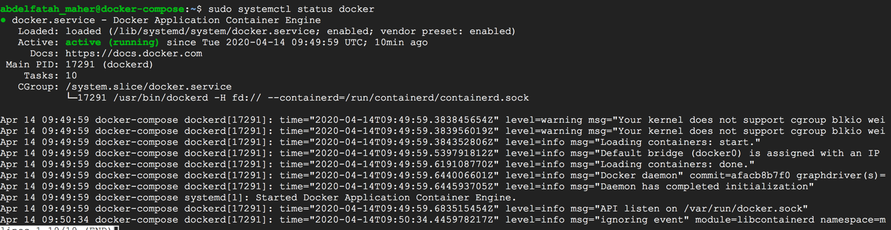
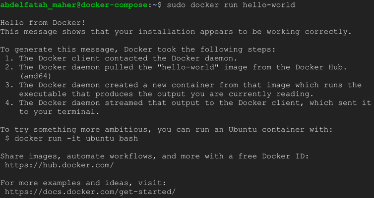

## 1. Update ubuntu system
    
        **Switch to root user**
        > sudo su -
        > sudo apt-get update
        > sudo apt-get upgrade

## 2. Install docker.

        **let apt use packages over HTTPS**
            > sudo apt install \
              apt-transport-https \
              ca-certificates \
              curl \
              software-properties-common

        **add the GPG key for the official Docker repository to your system**
            > curl -fsSL https://download.docker.com/linux/ubuntu/gpg | sudo apt-key add -

        **Verify that you now have the key with the fingerprint**
        *9DC8 5822 9FC7 DD38 854A  E2D8 8D81 803C 0EBF CD88*
            > sudo apt-key fingerprint 0EBFCD88

        **Add the Docker repository to APT sources**
            > sudo add-apt-repository \
              "deb [arch=amd64] https://download.docker.com/linux/ubuntu \
              $(lsb_release -cs) \
              stable"

        **install docker engine**
            > sudo apt update
            > sudo apt-get install docker-ce docker-ce-cli containerd.io
        
        **Check that docker is running.**
            > sudo systemctl status docker
    
    
        
        **Verify that Docker Engine is installed correctly by running the hello-world image.**
            > sudo docker run hello-world
    

## 3. Executing the Docker Command Without Sudo.

        ***Add your username to the docker group.**
            > 