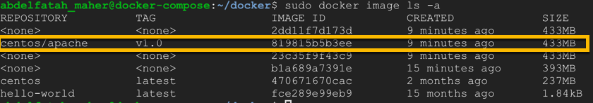
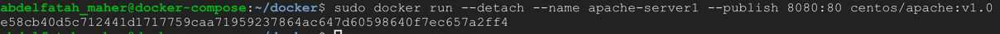
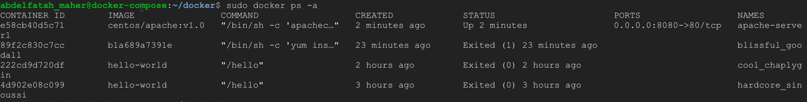

## Start docker service.
    > systemctl start docker

## Stop docker service.
    > systemctl stop docker

## Show docker service status.
    > systemctl status docker

## Installed docker version
    > sudo docker --version

## display exist images.
    > sudo docker images ls -a

## Display exist containers.
    > sudo docker contianers ls -a

## Prepare a centos image for editing
    **Get centos image from hub.docker.com**
        > sudo docker pull centos:latest
    
    **Check that the image is downloaded.**
        > sudo docker images ls -a
    
    **Run instance of the image inside a container.**
        > sudo docker run -d --name centos-container centos:latest

## Modify a Docker image.
    ### Update centos to most recent version.
    ### Install httpd webserver.
    ### Creating custom index page.
    ### start apache server in the background inside container.

        > mkdir docker
        > cd docker
        > vim Dockerfile

## Build edited image.
    
    # sudo docker build --tag 
    # <repository>: centos/apache
    # <tag>: v1.0
    
    ```
    > sudo docker build -t centos/apache:v1.0 .
    > sudo docker image ls -a
    ```

    

## Strat a container with the edited centos-image
    
    ```
    > sudo docker run --detach --name apache-server1 --publish 8080:80 centos/apache:v1.0
    ```

    

## Validate if the container is running
    
    ```
    > sudo docker ps -a
    ```

    

    ```
    > curl localhost:8080
    ```

## Check container IP.
    > sudo docker inspect apache-server1 | grep IPAddress